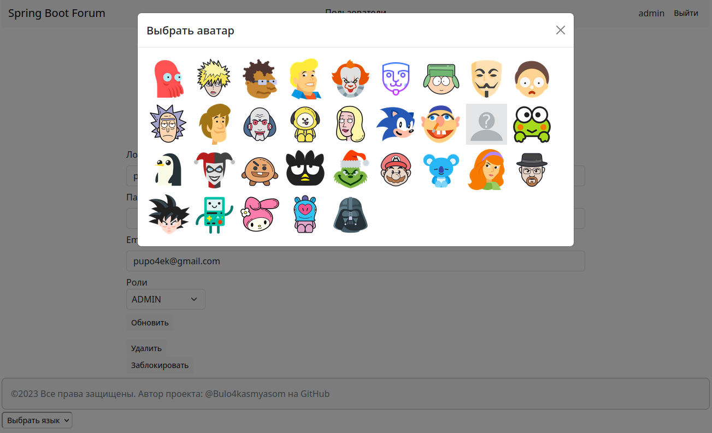

# Особенности
- сделана регистрация, авторизация пользователей
- разделение пользователей по ролям (админ, модератор, пользователь, гость)
- возможность создавать/удалять разделы, категории, подкатегории, темы, сообщения
- возможность множественного переноса/удаления тем
- для документирования подключен swagger
- реализован выбор языка
- запуск через docker

# Запуск
1. При необходимости править файл с переменными окружения: `.env`
2. В `src/main/resources/site.properties` указать путь к папке с ресурсами (html, js, css).

    Пример: `static.resources.path=file:/home/USERNAME/resources/static`
3. Этот путь так же указать в Dockerfile.
4. Выполнить команду: `docker compose up`

### Скриншоты

